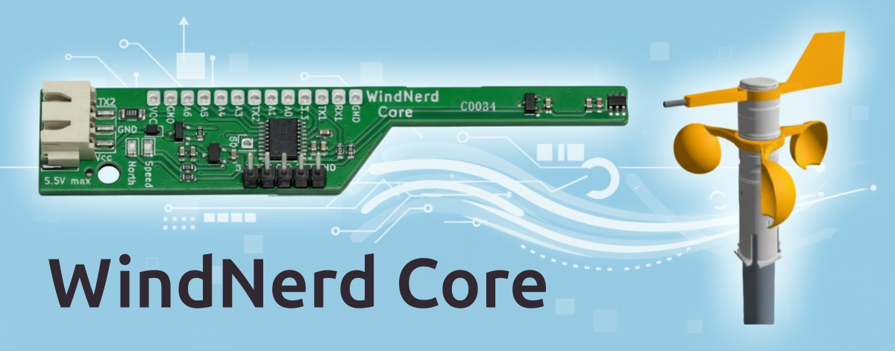
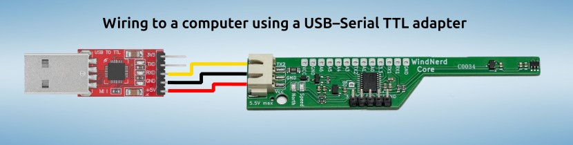

# WindNerd Core - Open Source Sensor & Development Board for 3D-Printed Anemometers

## Intro

The WindNerd Core is a **full magnetic** sensor board designed to fit inside the WindNerd [**3D-printed-anemometer**](https://github.com/windnerd-labs/Anemometer-3D-files).

It is [**available as a kit**](https://windnerd.net/en/shop), which includes the board and essential parts like magnets and bearings.

You can use it as a dedicated wind **sensor module** for your weather station, or as an **Arduino compatible development board** that can, for example:

- Control peripherals such as a radio modem to send data remotely
- Drive LEDs that blink according to wind speed and direction
- Interface with other sensors (e.g., temperature, humidity, pressure)

For development, an ST-Link V2 (or compatible) dongle is recommended. However, alternative firmwares can also be uploaded via a serial bootloader.

## Factory Firmware

The board is shipped with factory firmware that outputs instant wind values and averaged wind values over a serial connection.

The average power consumption is only **1.5mA** (3.3V or 5V).

It can be connected to a computer using a **USB-serial-TTL adapter** or to any MCU board that provides a **UART serial interface**.

The baudrate is 9600bps 8N1. This configuration allows fairly long wiring, e.g. to reach the top of a pole.  

Two types of messages are provided, the default speed unit is km/h and values are averaged for the last 10 minutes:  

**Instant wind** (every 3 Sec)

`WNI,<speed>,<direction 0-359>`
ex: `WNI,10.4,149`  

**Average wind report** (every minute)

`WNA,<speed avg>,<direction avg 0-359>,<min speed>,<max speed>`
ex: `WNA,12.2,93,0,21.4`  

The factory firmware is based on an [Arduino example sketch](examples/factory-v1/factory-v1.ino) that can be easily tweaked to your own needs.

[**How to read serial data from another device**](docs/READSERIAL.md)

## Arduino library

This repository provides an Arduino library that implements a driver for the magnetic sensors and computes wind speed and direction, exposing the values through a simple API.

[**How to install WindNerd Core library and program the board**](docs/PROGRAM.md)