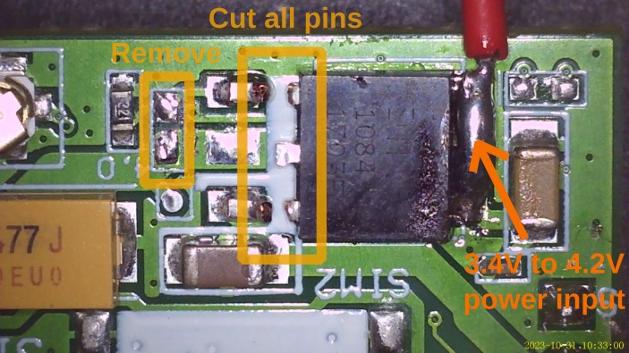
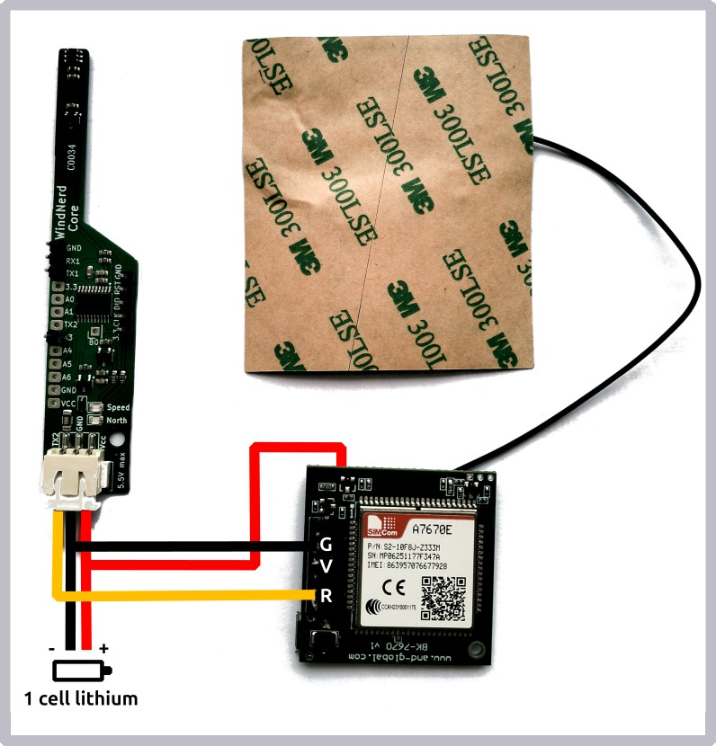

# LTE Cat-1 (4G) modem SIMCOM A7670X

## Intro
This example demonstrates how to use a SIMCOM A7670X LTE Cat-1 modem to upload wind data every 2 minutes using the [WindNerd Transfer Protocol](../../docs/WTP.md).

Between uploads modem is is placed into sleep mode to minimize power consumption. Measured system average is ~6 mA under good LTE coverage, enabling operation from a single 18650 cell recharged via a small solar panel.

Most SIMCOM and Quectel LTE modems using standard AT command sets can also work with minimal adaptation.

## LTE module

The A7670X exists in multiple regional versions based on LTE band support:

- A7670E Europe, Asia
- A7670SA South America
- A7670G Global

Typical module pricing ranges $10–$25 depending on version.

In this guide we use a A7670E module available for ~$13 on [Aliexpress](https://www.aliexpress.com/item/1005004176439432.html) under the brand "and-global".

 
## Wiring

### Powered from 5V
The module includes an onboard regulator and can be powered directly from 5V alongside the WindNerd Core. 

Always connect an antenna when powering the module up. 


### Powered from 1 lithium cell

For better efficiency, the A7670X chipset can be powered directly on lithium battery after a little modification on the module. We bypass the inefficient linear voltage regulator and remove a resistance that wastes too much current to the ground.



Now the battery positive wire should be soldered directly on the board.




## WindNerd Core Programming

Open lte-modem-A7670X example sketch, find the line below and replace the secret key with one available on your [windnerd dashboard](https://windnerd.net/en/management):

`#define WTP_SECRET_KEY "af3ffa12c4937ddf"`

[Compile and upload](../../docs/PROGRAM.md) the sketch to your WindNerd Core


## Commissioning

When powered with a SIM card inserted, the module will automatically attach to the network even without WindNerd Core connected.

On-board LED behavior:

| LED State              | Meaning                              |
| ---------------------- | ------------------------------------ |
| On solid after startup | Module boot OK                       |
| Fast blinking          | Connected and data service available |
| OFF                    | Module powered down or in sleep mode |


Around 2 minutes after powering-up, the station set for your device will show live wind data.

## Debugging (Reading AT Responses)

To inspect the modem’s AT command responses, you can connect a USB-Serial (TTL) adapter to the module’s UART Tx.
This allows you to watch live communication using a terminal such as PuTTY, Screen, or minicom.


| Serial-TTL adapter   | A7670X module |
| ---------- | ---------- |
| Gnd | Gnd (G) |
| Rx  | Tx (T)  |


### Start-up
When the A7670X powers up with a valid SIM card, it will output several startup notifications.
A typical healthy boot sequence looks like this:

```
[2025-11-10 14:05:24] *ATREADY: 1
[2025-11-10 14:05:24] 
[2025-11-10 14:05:24] *ISIMAID: "A0000000871004F310FFFF89080000FF"
[2025-11-10 14:05:25] 
[2025-11-10 14:05:25] +CPIN: READY
[2025-11-10 14:05:29] 
[2025-11-10 14:05:29] SMS DONE
[2025-11-10 14:05:29] 
[2025-11-10 14:05:29] +CGEV: EPS PDN ACT 1

```

`+CGEV: EPS PDN ACT 1` indicates that the module is attached to network.

### Upload Sequence
Every upload cycle, the sketch sends a small HTTP POST request using the WindNerd Transfer Protocol.

Expected output during a successful upload:

```
[2025-11-10 14:07:19] AT
[2025-11-10 14:07:19] OK
[2025-11-10 14:07:19] AT+HTTPINIT
[2025-11-10 14:07:20] OK
[2025-11-10 14:07:20] AT+HTTPPARA="URL","http://wtp.windnerd.net/post"
[2025-11-10 14:07:20] OK
[2025-11-10 14:07:20] AT+HTTPDATA=765,10000
[2025-11-10 14:07:20] DOWNLOAD
[2025-11-10 14:07:20] 
[2025-11-10 14:07:20] OK
[2025-11-10 14:07:20] AT+HTTPACTION=1
[2025-11-10 14:07:20] OK
[2025-11-10 14:07:22] 
[2025-11-10 14:07:22] +HTTPACTION: 1,200,2
[2025-11-10 14:07:22] AT+HTTPTERM
[2025-11-10 14:07:22] OK
```
`+HTTPACTION: 1,200,2` indicates server responded with HTTP 200 OK
