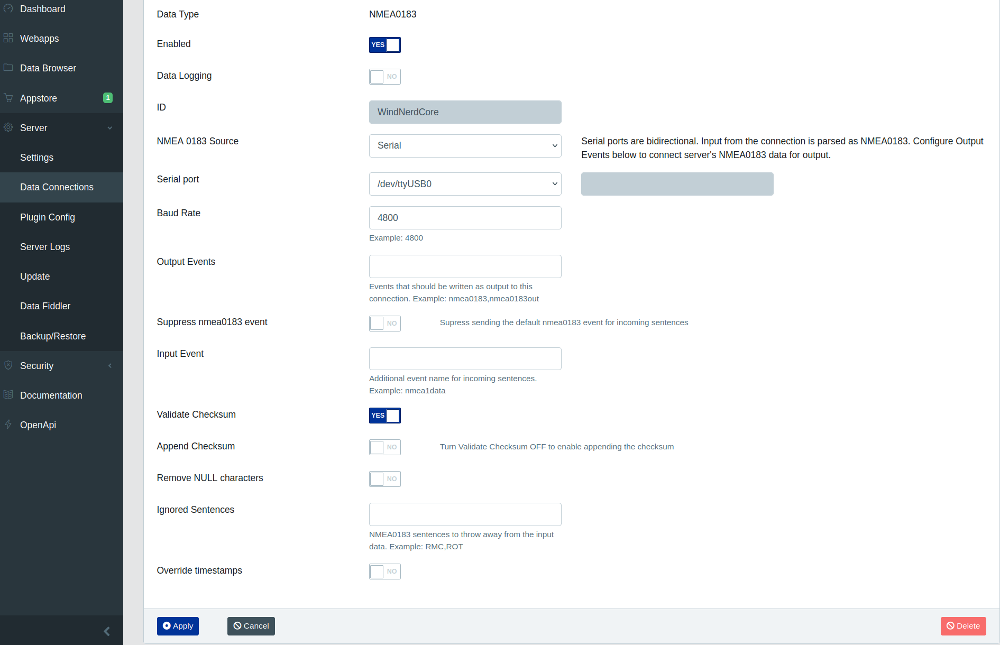
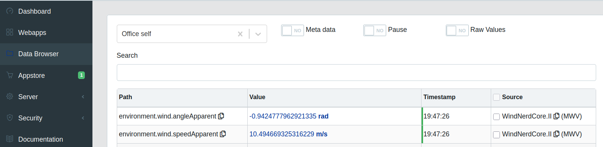

# NMEA0183 over serial

## Intro

With this sketch, the WindNerd Core emulates a NMEA 0183 compatible wind sensor.

The communication format follows the NMEA 0183 protocol (ASCII sentences such as $IIMWV,...). However, the electrical characteristics of the WindNerd Core serial output (0–3.3V UART logic level) are not compliant with the official NMEA 0183 electrical standard.

In this example, we connect the WindNerd Core to a computer (for example a Raspberry Pi) using a USB-to-TTL serial converter.

We then configure **Signal K** to treat this serial device as a NMEA 0183 input.

## SignalK configuration

On the Signal K web interface:

- Go to Server → Data Connections

- Click Add

- Create a connection as below

`/dev/ttyUSB0` may be different on your system

If the WindNerd Core is connected and transmitting, wind data should appear in:

Server → Data Browser

You should see path `environment.wind.speedApparent` and `environment.wind.angleApparent` refreshed every 3 seconds.

If nothing appears, try to restart Signal-K server.

